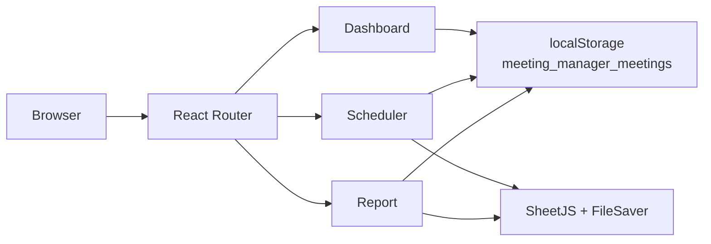

<p align="center">
  
</p>

<h1 align="center">Meeting Manager</h1>

<p align="center">A focused React workspace for scheduling meetings, capturing client context, and exporting shareable reports.</p>

<p align="center">
  <a href="https://meeting-manager-psi.vercel.app"></a>
  <a href="https://github.com/vincenzo-afk/MEETING-MANAGER/actions/workflows/ci.yml"></a>
  
  
  
</p>

<p align="center">
  <a href="https://meeting-manager-psi.vercel.app">Live demo</a> ·
  <a href="#getting-started">Documentation</a> ·
  <a href="https://github.com/vincenzo-afk/MEETING-MANAGER/issues/new">Report a bug</a> ·
  <a href="https://github.com/vincenzo-afk/MEETING-MANAGER/issues/new">Request a feature</a>
</p>

---

## <a name="table-of-contents"></a>Table of Contents

- [About the Project](#about-the-project)
- [Tech Stack](#tech-stack)
- [Getting Started](#getting-started)
- [Usage](#usage)
- [API Reference](#api-reference)
- [Project Structure](#project-structure)
- [Features & Roadmap](#features--roadmap)
- [Testing](#testing)
- [Deployment](#deployment)
- [Contributing](#contributing)
- [Security](#security)
- [License](#license)
- [Acknowledgments](#acknowledgments)
- [Footer](#footer)

---

## <a name="about-the-project"></a>About the Project

Meeting Manager is a client-side single-page application for organizing business meetings in one browser-based workspace. It combines scheduling fields, client and business context, status tracking, a dashboard, detailed reports, and spreadsheet exports so that meeting information can be captured once and reused in follow-up workflows.

The application stores meeting records in the browser's `localStorage`. It does not include a server, authentication, database, or external API layer, so records remain local to the browser profile where they were created. The live deployment is available at [meeting-manager-psi.vercel.app](https://meeting-manager-psi.vercel.app).

### Key Features

- Create and edit meetings with title, date, time, participants, agenda, status, client details, relationship-manager requirements, business details, and remarks.
- View dashboard-level meeting counts and filter the meeting table by status.
- Identify overdue meetings automatically when an upcoming meeting date has passed.
- Browse meetings in a date-sorted report view and preserve the selected report through the `?id=` URL query parameter.
- Export an individual meeting to a two-sheet Excel workbook containing meeting information and client/business information.
- Export all meetings to a consolidated Excel workbook or download a JSON backup.
- Use responsive React and Tailwind CSS layouts for desktop and smaller screens.

### Architecture Overview



The browser is the only runtime boundary. React pages call the storage helpers for CRUD operations, while the Excel utilities transform records into downloadable workbooks in the browser.

---

## <a name="tech-stack"></a>Tech Stack

| Area | Technologies used in the repository |
|---|---|
| Frontend | React `^18.2.0`, React DOM `^18.2.0`, React Router DOM `^6.30.3` |
| Build tooling | Vite `^4.4.5`, `@vitejs/plugin-react` `^4.0.3` |
| Styling | Tailwind CSS `^3.4.19`, PostCSS `^8.5.10`, Autoprefixer `^10.5.0`, Google Fonts Inter |
| Data and exports | Browser `localStorage`, SheetJS `xlsx` `^0.18.5`, FileSaver `^2.0.5`, UUID `^13.0.0` |
| Quality tooling | ESLint `^8.45.0`, eslint-plugin-react, eslint-plugin-react-hooks, eslint-plugin-react-refresh |
| Deployment | Static Vite output in `dist/`; no container or platform-specific deployment configuration is committed |
| Backend and database | None; this repository is client-only |

Versions above are the declared package ranges in `package.json`; the committed `package-lock.json` records the resolved dependency tree.

---

## <a name="getting-started"></a>Getting Started

### Prerequisites

Install Node.js and npm. The repository does not declare an `engines` field; use the Node.js version supported by your deployment environment. The CI workflow uses Node.js 20.x as its reproducible check environment.

### Installation

```bash
git clone https://github.com/vincenzo-afk/MEETING-MANAGER.git
cd MEETING-MANAGER
npm ci
```

### Development server

Start Vite's development server with Hot Module Replacement (HMR):

```bash
npm run dev
```

Vite prints the local URL in the terminal. Open that URL in a browser and use the Scheduler, Dashboard, and Reports views.

### Available scripts

| Command | Purpose |
|---|---|
| `npm run dev` | Start the Vite development server with HMR. |
| `npm run lint` | Run ESLint against JavaScript and JSX source files with warnings treated as failures. |
| `npm run build` | Create the production bundle in `dist/`. |
| `npm run preview` | Serve the built `dist/` directory locally for a production-style preview. |

### Configuration

No environment variables or `.env` files are read by the application. Meeting data is persisted under the browser storage key `meeting_manager_meetings`. Clearing site data or changing browser profiles removes access to the records stored in that profile, so use the JSON or Excel backup actions before doing so.

---

## <a name="usage"></a>Usage

### Create a meeting

1. Open the Scheduler view.
2. Complete the required meeting title, date, and client name fields.
3. Add optional time, participants, agenda, status, contact, address, relationship-manager requirement, business details, and remarks information.
4. Save the meeting. The record is written to `localStorage` and becomes available to the dashboard and report views.

### Edit, filter, and review

Use the dashboard table to filter records by status or open a meeting for editing. The Reports view sorts meetings by date in descending order. Selecting a meeting updates the URL with a query parameter in this form:

```text
/report?id=<meeting-id>
```

The exact route prefix is determined by the React Router configuration in `src/App.jsx`.

### Export records

The Reports view provides an individual Excel export for the selected meeting and an **Export All** action for the complete collection. Individual workbooks contain `Meeting Info` and `Client & Business` sheets. The application also exposes a JSON backup helper for the complete local collection.

### Preview a production build

```bash
npm run build
npm run preview
```

---

## <a name="api-reference"></a>API Reference

Meeting Manager has no HTTP API, backend routes, authentication endpoints, or database service. All data operations happen in the browser through the helpers in `src/utils/storage.js`.

| Client-side operation | Implementation |
|---|---|
| Read all meetings | `getMeetings()` reads and parses `meeting_manager_meetings`. |
| Create a meeting | `addMeeting(meeting)` appends a record and saves the collection. |
| Update a meeting | `updateMeeting(id, updated)` merges changes into the matching record. |
| Delete a meeting | `deleteMeeting(id)` removes the matching record. |
| Read one meeting | `getMeetingById(id)` returns a matching record or `null`. |
| JSON backup | `exportAllMeetingsJSON()` downloads the complete collection. |

The application has no server-side rate limiting or authentication because it does not send meeting records to a server.

---

## <a name="project-structure"></a>Project Structure

```text
.
├── public/
│   ├── logo.svg                 # Application logo and favicon source
│   └── vite.svg                 # Vite asset
├── src/
│   ├── assets/react.svg         # Starter asset retained in the source tree
│   ├── components/
│   │   ├── ExportButton.jsx     # Selected-meeting Excel export action
│   │   ├── Logo.jsx             # Reusable logo component
│   │   ├── MeetingCard.jsx      # Detailed meeting report card
│   │   ├── MeetingForm.jsx      # Create/edit form and validation
│   │   ├── MeetingTable.jsx     # Meeting list, filters, and actions
│   │   └── Navbar.jsx            # Application navigation
│   ├── pages/
│   │   ├── Dashboard.jsx        # Summary cards and meeting table
│   │   ├── Report.jsx           # Report selection and export view
│   │   └── Scheduler.jsx        # Meeting scheduling workflow
│   ├── utils/
│   │   ├── excelExport.js       # Excel workbook creation
│   │   ├── formatters.js        # Date, time, and derived-status formatting
│   │   └── storage.js           # localStorage CRUD and JSON backup helpers
│   ├── App.css                  # Application-level styles
│   ├── App.jsx                  # Router and application shell
│   ├── index.css                # Tailwind directives and global styles
│   └── main.jsx                 # React entry point
├── .github/workflows/ci.yml    # Install, lint, and build checks
├── .eslintrc.cjs               # ESLint configuration
├── index.html                   # Vite HTML entry point and metadata
├── package.json                 # Scripts and dependency declarations
├── package-lock.json            # Locked npm dependency tree
├── postcss.config.js            # PostCSS configuration
├── tailwind.config.js           # Tailwind content and theme configuration
└── vite.config.js               # Vite React plugin configuration
```

---

## <a name="features--roadmap"></a>Features & Roadmap

### Current functionality

- ✅ Meeting creation and editing.
- ✅ Required-field and phone-number validation.
- ✅ Browser-local persistence through `localStorage`.
- ✅ Dashboard counts and status filtering.
- ✅ Automatic overdue status derivation for past upcoming meetings.
- ✅ Date-sorted reports with URL-selected meeting state.
- ✅ Individual and bulk Excel exports.
- ✅ JSON backup helper.
- ✅ Responsive Tailwind CSS interface.

### Known limitations and possible next steps

The current implementation is intentionally local-first: it has no multi-user synchronization, authentication, server-side backup, automated reminder service, or automated unit/integration test suite. Future work could add those capabilities without changing the existing browser-only workflow, but they are not implemented in this repository.

For repository-level history, see the [commit log](https://github.com/vincenzo-afk/MEETING-MANAGER/commits/main).

---

## <a name="testing"></a>Testing

The repository currently has no test script or test directory. The available automated quality checks are linting and a production build:

```bash
npm ci
npm run lint
npm run build
```

The GitHub Actions workflow runs the same lint and build commands on pushes and pull requests targeting `main`. The dependency installation may report npm audit findings from the locked dependency tree; review those separately with `npm audit` before applying upgrades.

---

## <a name="deployment"></a>Deployment

The project produces a static bundle and can be deployed to any host that serves the contents of `dist/`. There is no Dockerfile, compose file, Kubernetes manifest, or provider-specific configuration in the repository.

A generic deployment sequence is:

```bash
npm ci
npm run build
```

Publish the resulting `dist/` directory with a static hosting provider. The repository's current live deployment is [meeting-manager-psi.vercel.app](https://meeting-manager-psi.vercel.app); its provider configuration is not committed here.

---

## <a name="contributing"></a>Contributing

Contributions are welcome through pull requests. Start by creating a focused branch from `main`, install dependencies with `npm ci`, and run both `npm run lint` and `npm run build` before opening a pull request. Explain the user-facing impact, include relevant screenshots for UI changes, and call out any data-format or export changes.

Please keep changes small and maintain the existing React/Vite structure. Commit messages should be concise and action-oriented; Conventional Commits are recommended for new changes. See [CONTRIBUTING.md](CONTRIBUTING.md) for the repository workflow and pull-request checklist.

---

## <a name="security"></a>Security

Meeting data is stored in browser `localStorage` and is not encrypted by the application. Do not use the app for sensitive information unless the browser profile and device are appropriately secured, and export backups only to trusted locations.

The repository has no authentication, server-side secret handling, or dependency-scanning workflow. To report a suspected vulnerability privately, contact the repository owner at [itsmebk2007@gmail.com](mailto:itsmebk2007@gmail.com) and include only the information needed to reproduce the issue. Do not publish sensitive details in a public issue.

See [SECURITY.md](SECURITY.md) for the reporting policy.

---

## <a name="license"></a>License

No `LICENSE` file is currently present in this repository. Until the owner adds a license, the source should be treated as **all rights reserved** and should not be redistributed or reused beyond applicable legal rights. Add an explicit license before inviting reuse as an open-source package.

---

## <a name="acknowledgments"></a>Acknowledgments

Meeting Manager is maintained by [vincenzo-afk](https://github.com/vincenzo-afk). The project is built with the React, Vite, Tailwind CSS, React Router, SheetJS, FileSaver, UUID, and ESLint ecosystems. Their official documentation is linked in the [References](#references) section below.

---

## <a name="footer"></a>Footer

[Back to top](#meeting-manager)

- **GitHub:** [vincenzo-afk/MEETING-MANAGER](https://github.com/vincenzo-afk/MEETING-MANAGER)
- **Live application:** [meeting-manager-psi.vercel.app](https://meeting-manager-psi.vercel.app)
- **Issues and support:** [GitHub Issues](https://github.com/vincenzo-afk/MEETING-MANAGER/issues)

Built by [vincenzo-afk](https://github.com/vincenzo-afk).

---

## <a name="references"></a>References

- [1] [React documentation](https://react.dev/)
- [2] [Vite documentation](https://vitejs.dev/)
- [3] [Tailwind CSS documentation](https://tailwindcss.com/docs)
- [4] [React Router documentation](https://reactrouter.com/)
- [5] [SheetJS documentation](https://docs.sheetjs.com/)
- [6] [FileSaver.js repository](https://github.com/eligrey/FileSaver.js)
- [7] [GitHub repository topics guidance](https://docs.github.com/en/repositories/managing-your-repositorys-settings-and-features/customizing-your-repository/classifying-your-repository-with-topics)

<!-- Project: Meeting Manager -->
